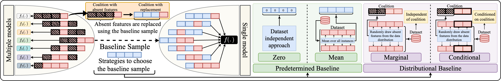

<h1 align="center">🔍 Shapley Values Evaluation</h1>
<h2 align="center">A Comprehensive Evaluation of Shapley Value Approximations</h2>

## 📄 Contents
1. 🔎 [Overview](#overview)
2. ⚙️ [Get Started](#start)
3. 📊 [Evaluation](#evaluation)
4. 📫 [Evaluation](#evaluation)
5. [Evaluation](#evaluation)
 
   
<h2 id="overview"> 🔎 1. Overview </h2>
Understanding the choices made by machine learning models is essential for building trust and promoting real-world adoption. Shapley values have emerged as a principled and widely-used method for feature attribution. By considering all feature subsets, Shapley values offer comprehensive and fair explanations for model predictions.

However, computing exact Shapley values is computationally intractable (NP-hard), prompting the development of various approximation techniques. The abundance of such methods introduces a new challenge: **Which technique should practitioners trust?**

This work fills that gap through a **systematic and large-scale evaluation** of 17 Shapley value approximation algorithms across:
- 💯 **100 tabular datasets** from diverse domains
- 🧠 **6 model architectures**

We analyze two core aspects:
- **Replacement Strategies** for handling missing features
- **Tractable Estimation Strategies** to approximate Shapley values efficiently

Our results reveal critical trade-offs in accuracy, compute time, and robustness. This benchmark provides the foundation for selecting the right method and encourages further research in interpretable machine learning.

---

<h2 id="start"> ⚙️ 2. Get Started </h2>

### ✅ Prerequisites
You will need:
- `git`
- `conda` (Anaconda or Miniconda)

### 📦 Installation

**Step 1:** Clone this repository using `git` and change into its root directory.

```bash
git clone https://github.com/TheDatumOrg/ShapleyValuesEval.git
```

**Step 2:** Create and activate a `conda` environment named `shapeval`.

```bash
conda env create --file environment.yml
conda activate shapeval
```

<h2 id="evaluation"> 📊 3. Evaluation </h2>

We decompose the evaluation into **two principal dimensions**:

### 🧩 Replacement Strategies

These strategies define how to handle **missing features** in the Shapley framework. We compare 8 different strategies using an **exhaustive sampling** baseline for accuracy, enabling deep insights into their strengths and limitations.

<p align="center">

</p>

### ⚙️ Tractable Estimation Strategies

To address the computational burden, we evaluate **17 different estimation methods** that trade off fidelity for efficiency.

Each method is benchmarked using **100 datasets** and **6 types of predictive models**. The evaluation pipeline includes accuracy metrics, compute-time analysis, and critical difference diagrams to highlight statistically significant performance differences.


| Approaches                                | ⚙️ Estimation Strategy                |    🧩 Replacement Strategy                                       |
|-------------------------------------------|---------------------------------------|------------------------------------------------------------------|
| Exhaustive Sampling                       | Exact (All potential feature subsets) | Conditional Distribution: Separate Models                        |
| Interactions-based Method for Explanation | Random Order                          | Marginal Distribution: Empirical                                 |
| Conditional Expectations Shapley          | Random Order                          | Conditional Distribution: Empirical                              |
| Shapley Cohort refinement                 | Random Order                          | Conditional Distribution: Empirical                              |
| Multilinear Sampling                      | Multilinear Extension                 | Marginal Distribution: Empirical                                 |
| KernelSHAP                                | Weighted Least Squares                | Marginal Distribution: Empirical                                 |
| Parametric KernelSHAP                     | Weighted Least Squares                | Conditional Distribution: Parametric Assumption(Gaussian/Copula) |
| Non-Parametric KernelSHAP                 | Weighted Least Squares                | Conditional Distribution: Empirical                              |
| SGD-Shapley                               | Weighted Least Squares                | Predetermined Baseline: Mean                                     |
| FastSHAP                                  | Weighted Least Squares                | Conditional Distribution: Surrogate model                        |
| Independent LinearSHAP                    | Linear                                | Marginal Distribution: Empirical                                 |
| Correlated LinearSHAP                     | Linear                                | Conditional Distribution: Parametric Assumption(Gaussian)        |
| Tree Interventional                       | Tree                                  | Marginal Distribution: Empirical                                 |
| Tree Path-dependent                       | Tree                                  | Conditional Distribution: Empirical                              |
| DeepLIFT                                  | Deep                                  | Predetermined Baseline: All-zeros                                |
| DeepSHAP                                  | Deep                                  | Marginal Distribution: Empirical                                 |
| DASP                                      | Deep                                  | Predetermined Baseline: Mean                                     |


<h2 id="evaluation"> 📫 4. Contact </h2>

If you have any questions, suggestions, or ideas for improvement, feel free to:

- Open an issue on this repository
- Start a discussion
- Reach out via email: Suchit Gupte (gupte.31@osu.edu), John Paparrizos (paparrizos.1@osu.edu)

We welcome contributions and collaboration!

---

<h2 id="Acknowledgements"> ⭐ 5. Acknowledgements </h2>

This project is part of a broader initiative to standardize and democratize interpretability research in machine learning.
We thank the research community for their foundational work in Shapley value approximations and their continued efforts in explainable AI. This benchmark builds on their insights and aims to further the goal of trustworthy and transparent machine learning models.

